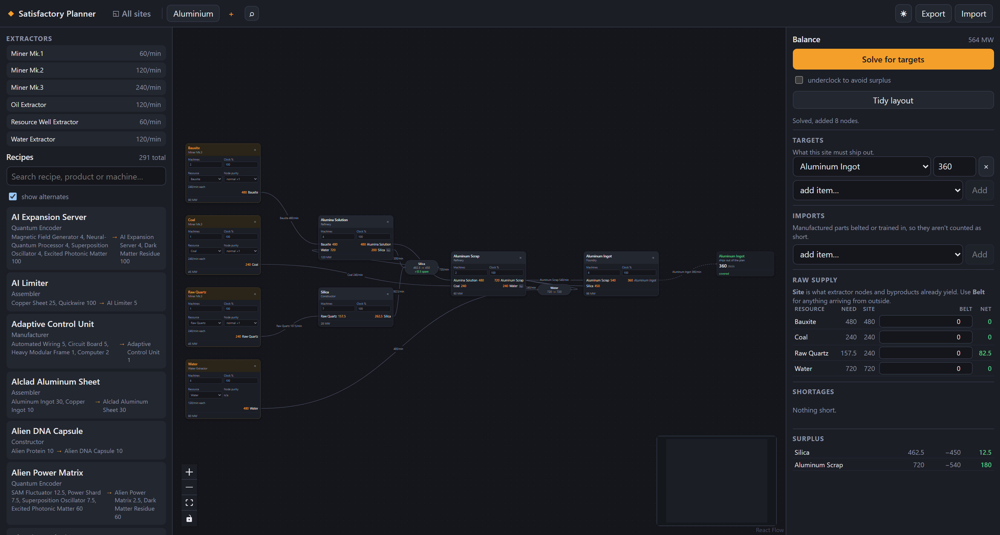

# Satisfactory Planner

Plan production for [Satisfactory](https://www.satisfactorygame.com/) as a node graph.
Say what a factory should ship, and it works out the building counts, power draw, raw
extraction and every item balance — across as many sites as you want to build.

**→ [Try it](https://luechtian.github.io/satisfactory-planner/)** · no install, no account



Runs entirely in your browser. Nothing is uploaded, there is no backend, and recipe data
comes from the game's own files rather than a hand-maintained list.

## What it does

**Solves backwards from a target.** Ask for 360 Aluminum Ingot/min and one click turns an
empty canvas into a complete factory: every building count, the intermediate steps you
forgot, and miners for the ores nothing else covers.

**Counts whole buildings.** You cannot build 1.5 Refineries, so it doesn't pretend you
can. Rounding a stage up raises demand on the stage above it, and the counts are
re-derived from each other until they settle — the same arithmetic you would do by hand.
Prefer exact rates? Tick *underclock to avoid surplus* and each stage is clocked onto its
demand instead.

**Knows about byproducts and loops.** Alumina Solution drinks water that Aluminum Scrap
hands back; the solve nets that out. Asking for Silica reaches for Raw Quartz rather than
scaling Alumina Solution to nine refineries to farm the byproduct.

**Handles extractors properly.** Miners, pumps and wells are nodes with a node purity and
a clock, and their power counts toward the total — leaving it out understates a
factory's draw by around 40%.

**Scales to a whole save.** Split work across sites, link one site's surplus to another's
shortfall, and see the lot on an **All sites** page: a map of which site feeds which,
power per group, raw extraction rolled up, and every item that crosses a boundary sorted
into what nothing covers, what could be routed, and what is simply spare.

The sidebar keeps the same picture to hand while you work: every site under its group with
its power draw, a red count on any that has gone short, and the actual items on hover. You
should not have to leave the site you are on to find out another one broke.

**Draws the belts, or lets you.** One building feeding one other gets a plain arrow; where
several make an item and several take it, they meet at a manifold. Drag between ports to
wire something specific — that is how you say two water extractors are separate
sub-factories rather than a shared pool. A building that recycles its own input, like the
Blender making Encased Uranium Cells, is shown as a net consumer until you wire one of
those ports; then both run at gross rates so the returned fluid can go where you send it.
You can wire straight to a manifold too, which puts that building on the pool and shows
both its arms rather than one netted figure. Manifolds, imports and exports can all be
dragged where you want them; **Tidy layout** puts them back.

**Shows its working before it rewrites anything.** **Plan a chain** is where you say
what the site should make, and it lays out the chain it is about to build — every step, the
recipe making it, its rate, its building and its inputs — and lets you change any of them
first.

A target is a seed, not a promise. Once the chain exists it stops counting against the
balance, so a site that makes 360 Aluminum Ingot/min reads **+360 spare** rather than a
useless net zero — which is also what lets another site's shortfall find it. It is still
remembered, so re-solving is a click and the site records what it was designed for; where
whole buildings overshoot, the surplus says so (*20/min · 3 over target*). Only what
another site actually imports counts as owed.

The same dialog is where you choose recipes. 76 items can be made more than one way, and
which alternate you have unlocked is half of what makes a base yours. Swap
Aluminum Ingot for *Alternate: Pure Aluminum Ingot* and the rest of the list follows
while you watch: Silica drops out, Water appears, because a different recipe needs
different inputs. Nothing is written until you press Solve, choices stick to the site, and
the whole thing is one Ctrl+Z.

**Says when a belt you drew cannot deliver.** Wire one water extractor to a refinery that
wants more than it makes and the site can still be perfectly balanced — there is enough
water, just not on that line. A site-level balance structurally cannot see that, which is
how the canvas came to show a red belt while the panel said nothing was short. Both now
appear under **Logistics**, and Shortages says so rather than claiming all is well.

**Knows a belt has a limit.** The solver counts buildings, not belts, so a perfectly
balanced plan can still call for 1800 Iron Ore down one line. Set which belt and pipe you
have unlocked and anything over that is marked on the canvas as *×2 lines* and listed
under **Logistics**. Each arm of a manifold counts as its own line; the pool is not a
line. Solids are checked against belts and fluids against pipes, which matters — 700/min
fits a Mk.5 belt and does not fit a Mk.2 pipe.

**Takes it back.** Ctrl+Z steps through anything that changed the plan — a solve that
rewrote a site, a deleted tab, an import that turned out to be the wrong file — and
Ctrl+Shift+Z puts it back. A drag is one step rather than two hundred, and typing a rate
is one step rather than one per digit. Switching tabs and folding a group are not edits
and stay out of it; undoing a change made elsewhere takes you to the site it happened on,
because otherwise you cannot see what moved.

## Quick start

Requires Node 20.19+ (Vite 8) and, only for regenerating recipe data, Python 3.9+.

```bash
git clone https://github.com/luechtian/satisfactory-planner
cd satisfactory-planner
npm install
npm run dev            # http://localhost:5199
```

`public/data.json` is committed, so this works without the game installed. To regenerate
it from your own copy — after a game update, say:

```bash
python scripts/extract_docs.py
```

It looks for the usual Steam library paths. If yours is elsewhere:

```bash
python scripts/extract_docs.py "D:/Steam/steamapps/common/Satisfactory/CommunityResources/Docs/en-US.json"
```

## Where plans are stored

In `localStorage`, scoped to the origin. Sites, building counts, clocks, node positions,
targets, imports and hand-drawn belts all survive a reload and a browser restart, but:

- they are per browser **and** per profile, and never sync anywhere;
- clearing site data wipes them, and private windows lose them on close;
- two tabs on the same plan will clobber each other, last write wins.

**Export** writes a JSON file, and you pick which sites go into it — one site, a group,
or the lot. That is the only durable copy, and the only way to hand work to someone else.

**Import** merges rather than replaces. The file is listed out first, each site marked
*new* or *replaces yours*, and you tick what to take — so two people can swap sites
regularly without either standing on the other's work. Sites are matched on an internal
id, which is shared exactly when a site came from the other person's export in the first
place; ones you each built separately stay separate however alike their names. Restoring
a whole backup is still there, behind **Replace whole plan**.

A link pointing at a site that did not travel with the file is kept, not stripped. It
shows as a broken link on the **All sites** page and reconnects on its own the day that
site is imported too.

## How the solver works

`src/core/solver.ts`, two passes.

**Forward** — `evaluateSite` takes building counts and sums production against consumption
per item.

**Backward** — `solveSite` takes targets and finds counts that meet them. An iterative
pass discovers which recipes the chain needs, the resulting square system is solved
exactly by Gaussian elimination, and the rates are then turned into whole buildings. Three
things a naive expansion gets wrong:

- **Byproducts credit, they never justify.** A recipe is scaled for its primary product
  only, otherwise a byproduct becomes a reason to overbuild its parent.
- **Whole buildings change the answer upstream.** 1.5 Aluminum Scrap refineries become 2,
  and 2 of them eat 480 Alumina rather than 360 — which is 4 Alumina refineries, not 3.
- **Loops must close.** The iterative pass alone overshoots, because rates only climb and
  one gets locked in before the byproduct credit arrives.

## Tests

```bash
npm test
```

Vitest, no browser, under a second. Six suites:

- `tests/solver.test.ts` — balances, whole-building derivation, byproduct credit, water
  loops, idempotent solving, cross-site links and derived exports.
- `tests/routing.test.ts` — what the canvas connects to what. Every case in it is a bug
  that shipped: a building recycling its own input becoming unreachable, hand-drawn belts
  being silently topped up from elsewhere, import and export nodes losing their wires.
- `tests/transfer.test.ts` — exchanging sites between two plans: what a partial export
  carries, what replaces what on the way back in, and the links that dangle until the
  site they name turns up. Mostly one question asked several ways — does taking someone
  else's file ever take your own work with it.
- `tests/throughput.test.ts` — what one belt or pipe carries, and which arrows need
  splitting across more than one. Mostly guarding that a gas is checked against a pipe
  and not a belt, where it would look fine at any rate at all.
- `tests/history.test.ts` — what counts as one undo step. A node drag fires an update per
  pointer move, so the whole difference between a usable undo and an unusable one is in
  the coalescing rules.
- `tests/planStore.test.ts` — the wiring rather than the rules: that every action routes
  through the single write path, that an action changing nothing spends no step, and that
  stepping back leaves you on the site the change was made on.

That second file is why `src/core/routing.ts` exists as its own module. The logic used to
live inside a `useMemo` in the canvas component, where none of it could be tested — and
every routing bug so far has been pure logic rather than rendering.

## Recipe data

`scripts/extract_docs.py` reads `Docs.json`, which the game ships in
`CommunityResources` for exactly this purpose, and normalises the awkward parts:

- UTF-16, with nested structs stored as Unreal property-blob strings.
- Fluids and gases recorded in litres, 1000× the in-game m³ display.
- Most alternate recipes carry a `Recipe_Alternate_` class prefix — but some, such as
  `Recipe_PureAluminumIngot_C`, are only marked in the display name.
- Buildings, paint and handcraft-only entries filtered out.

Current dump: **291 recipes** (111 alternate), 168 items, 17 buildings.

## Not built yet

- **LP optimiser** — "maximise X given these ore nodes", *choosing* among alternates
  rather than being told. You can pin a recipe by hand today; what is missing is having
  the solver work out which pins are best. The data model is ready; HiGHS-WASM over the
  same recipe matrix would do it. It is also what would make raw supply a real
  constraint rather than a note.
- **Route-aware solving.** The solver still works on site-level totals, so it sizes
  buildings without knowing which belt feeds which. A hand-drawn belt that cannot deliver
  is now *reported* under Logistics rather than only turning red, but the solve itself
  will not size a chain around the topology you drew.
- **Joint solving across links.** Links are checked, not solved together: if A draws from
  B while B draws from A, each number is sensible on its own but the pair never resolves.
- **Live comparison against a running game**, which would need the
  [FicsIt Remote Monitoring](https://docs.ficsit.app/ficsitremotemonitoring/latest/json/json.html)
  mod. Vanilla installs expose nothing.

## Project layout

```
scripts/extract_docs.py   Docs.json -> public/data.json
src/core/types.ts         data + plan model
src/core/data.ts          indexing, search, power
src/core/solver.ts        forward + backward passes
src/core/layout.ts        layered auto-layout
src/core/routing.ts       what connects to what, and at what rate
src/core/overview.ts      cross-site rollup and links
src/core/transfer.ts      partial export, merging a file in
src/core/history.ts       undo/redo snapshots and what counts as a step
src/core/throughput.ts    belt and pipe limits, and what needs splitting
src/store/planStore.ts    zustand state, localStorage
src/ui/                   canvas, nodes, panels, tabs
```

Built with [React Flow](https://reactflow.dev), [Zustand](https://zustand-demo.pmnd.rs)
and [Vite](https://vite.dev).

## Deploying

`npm run build` produces a static `dist/`. `.github/workflows/deploy.yml` publishes to
GitHub Pages on every push to `main` — set **Settings → Pages → Source: GitHub Actions**
before the first run, or `configure-pages` fails with `Get Pages site failed … Not Found`.

`base: "./"` in `vite.config.ts` is what lets it work from a `/<repo>/` subpath.

## Licence and attribution


Satisfactory is a game by [Coffee Stain Studios](https://www.coffeestainstudios.com/).
This project is unofficial and unaffiliated. Item and recipe names come from the game's
own `CommunityResources` data dump, which exists for community tools like this one.

The planner itself is [MIT licensed](LICENSE) — use it, fork it, ship it.
